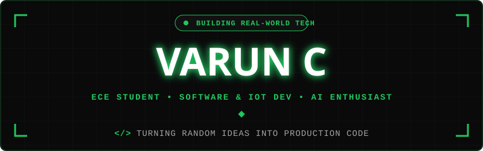

  

  

  

  

  

  

<h2 align="center">About Me</h2>

  

  

  Hey! I'm <b>Varun C</b>, a third-year 
  <b>Electronics and Communication Engineering student</b>
  at <b>KPR Institute of Engineering and Technology</b>. 

  I am interested in <b>software development, AI/ML, IoT and web technologies</b>.
  I enjoy building practical projects that combine software, hardware, and intelligent systems,
  particularly in the areas of IoT and AI.

  

  

  

  <b>Let's Discuss:</b>
  Java, C++, Python, React, AI/ML, IoT & DSA.
   

  <b>Goal:</b>
  <i>Grow into a skilled software developer by building meaningful projects and developing strong problem-solving abilities.</i>

<h2 align="center">Featured Projects</h2>

<table width="100%" border="0" align="center">

<tr>

<td width="50%" align="center" style="padding: 14px;">

<h4>Smart Portable Water Purifier</h4>

Smart automated IoT portable water purifier application using Flutter, ESP32 BLE and Firebase. Displays real-time sensor data such as pH, TDS, temperature, dissolved oxygen and Water Quality Index.
  
<a href="[EDIT HERE]">View Project</a>

</td>

<td width="50%" align="center" style="padding: 14px;">

<h4>GestureX</h4>

A smart glove project using ESP-32 for gesture communication. Designed to improve communication for deaf and dumb people and support applications such as fall detection and gesture-based device control.
  
<a href="[EDIT HERE]">View Project</a>

</td>

</tr>

<tr>

<td width="50%" align="center" style="padding: 14px;">

<h4>Work @ Eaze HRMS – Reports Module</h4>

Designed and documented the Reports Module providing HR administrators with centralized access to employee and payroll reports, featuring UI/UX design, filtering, generation, dashboards, export functionality, and access control.
  
<a href="[EDIT HERE]">View Project</a>

</td>

<td width="50%" align="center" style="padding: 14px;">

<h4>Health Monitoring & Fatigue Detection Wearable</h4>

A real-time AI-powered health monitoring and fatigue detection wearable designed to detect potentially hazardous environments (SIH).
  
<a href="[EDIT HERE]">View Project</a>

</td>

</tr>

</table>

<h2 align="center">Tech Stack & Skills</h2>

  <b>Programming Languages</b>

  

  <b>Frontend & Mobile</b>

  

  <b>Backend, Cloud & Database</b>

  

  <b>AI, IoT & Tools</b>

  

<h2 align="center">Achievements</h2>

<ul>
  <li><b>IEEE SBC 2k25</b> - Third Place - IEEE PES SBC PROJECT PRESENTATION</li>
  <li><b>STEM INNOVATORS</b> - First place - GestureX</li>
  <li><b>BIT Hackathon</b> - Second place — Software innovation</li>
  <li><b>IEEE - WIE</b> - project presentation - Second place - Nutriscan</li>
  <li><b>Embrix Vegathon</b> - Selected as finalists from 1000+ teams to top 50 teams.</li>
  <li><b>SindhanAI 2K25 national-level hackathon</b> - Top 5 among 57 IoT teams and Top 4 finalist.</li>
</ul>

<h2 align="center">Certifications</h2>

<ul>
  <li><b>ISRO-IIRS Online Course</b> – Remote Sensing and Digital Image Analysis</li>
  <li><b>AI/ML Certification</b> – Wersel</li>
  <li><b>NPTEL</b> - Introduction to Industry 4.0 and Industrial Internet of Things</li>
  <li><b>NPTEL</b> - Blockchain and its Applications</li>
</ul>

<h2 align="center">Roles & Volunteering</h2>

<ul>
  <li><b>Joint Secretary</b> of SPARTRANZ - ECE Department</li>
  <li><b>IEEE Event Coordinator</b> - Intelec</li>
</ul>

<h2 align="center">DSA & Coding</h2>

  <i>Currently learning and practicing Data Structures and Algorithms using Java.</i>

  

<h2 align="center">GitHub Analytics</h2>

  

  

  

<h2 align="center">Contribution Journey</h2>

  

<h2 align="center">Let's Connect & Collaborate</h2>

  <i>
    Interested in software development, AI, IoT, DSA and building
    practical projects.
  </i>

  

  

  

  <b>Thanks for visiting my profile! 🚀</b>

